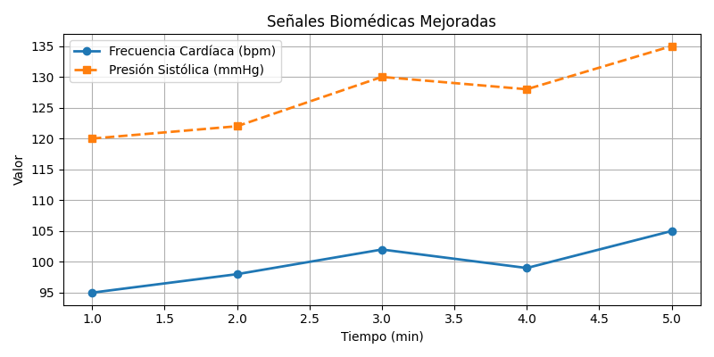

# Proyecto 1 — Señales Biomédicas

Este proyecto grafica y analiza dos señales fisiológicas simuladas:
- Frecuencia Cardíaca (bpm)
- Presión Arterial Sistólica (mmHg)

El objetivo es representar cómo varían estas señales a lo largo del tiempo .
Gráfico Generado

# senales_biomedicas.ipynb-senales_biomedicas.png
Gráfica de presión y frecuencia cardiaca

 ¿Qué aprendí?

- Crear variables en Python
- Manipulación básica de listas
- Visualización de datos biomédicos
- Guardar gráficos como imagen (.png)

